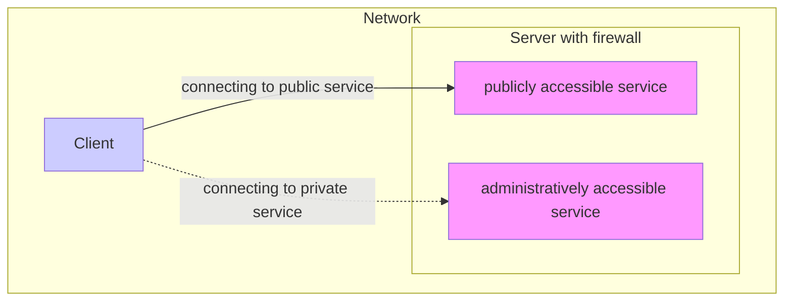
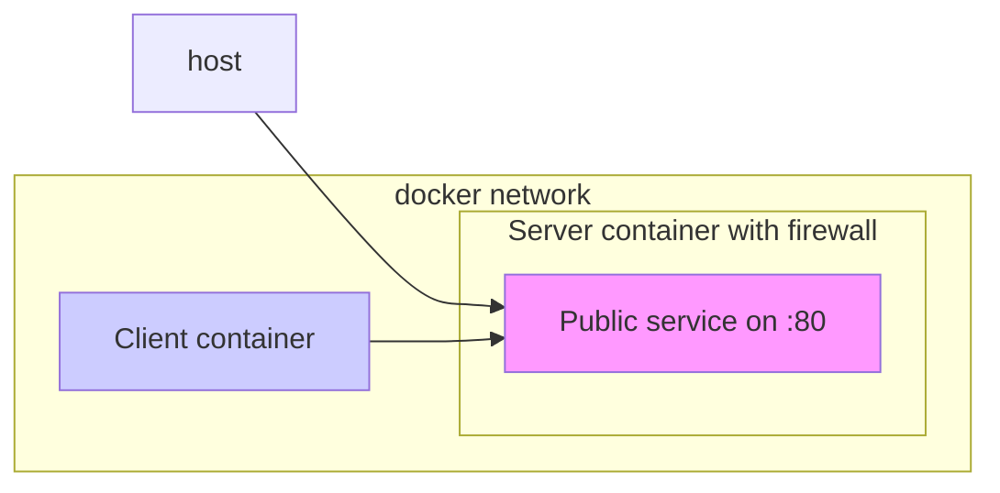
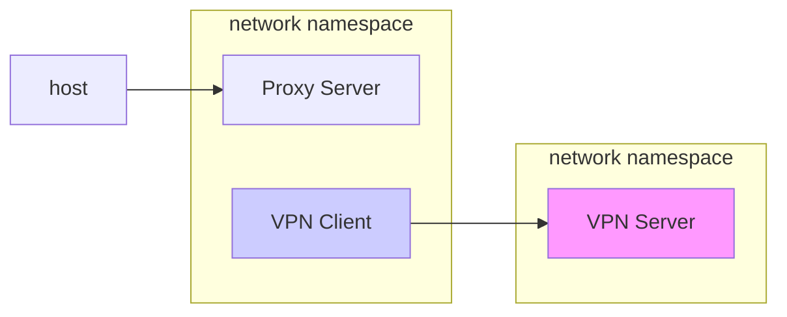
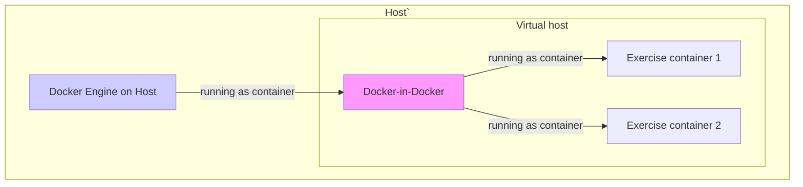
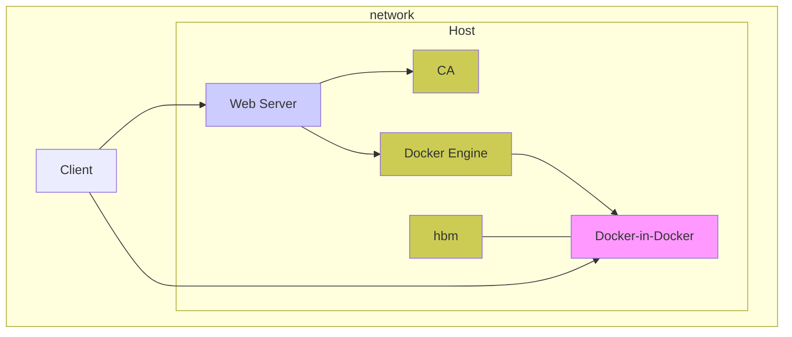
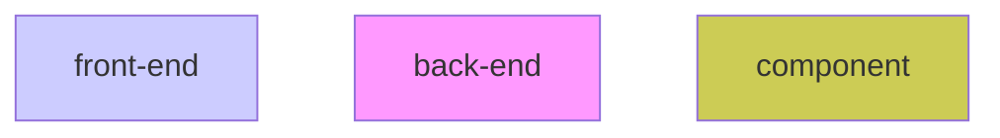
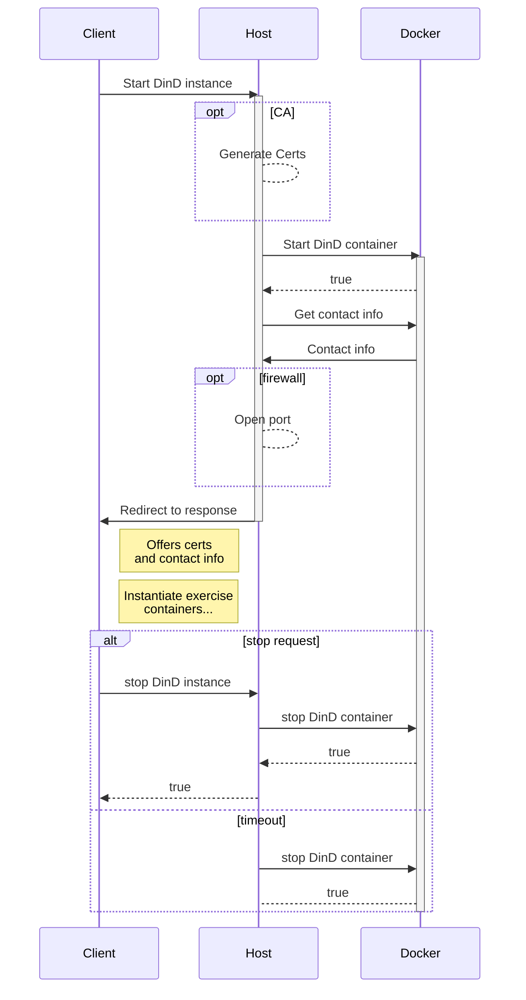
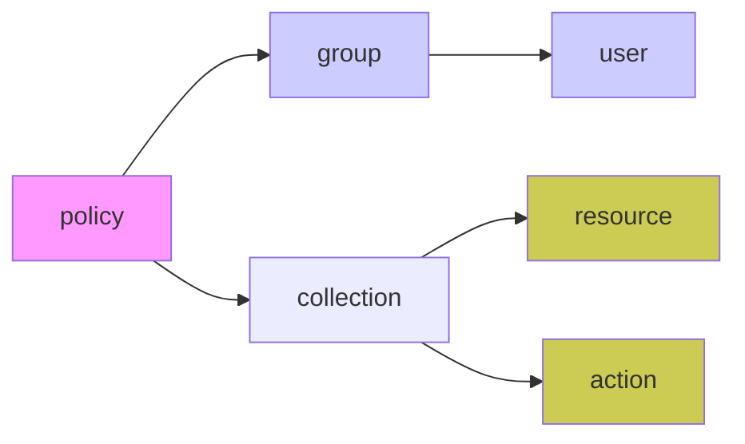

<h1 align="center" style='padding-top: 20%'>Docker Containers for Exercises</h1>

<div style='padding-top: 10%'>

Last modified: **2019-03-03**

Version: **1.1 (Export)**

Author: **[Christian Bauer \<cbauer@mail.de\>](mailto:Christian%20Bauer%20%3Ccbauer%40mail.de%3E)**
</div>

<h3 style='page-break-before: always;'>Table of Contents</h3>

- [Motivation](#motivation)
- [Technology](#technology)
  - [Fundamentals](#fundamentals)
  - [Image](#image)
  - [Container](#container)
  - [Networking](#networking)
  - [Capabilities](#capabilities)
  - [Namespaces](#namespaces)
- [Containers](#containers)
  - [Notes](#notes)
  - [Shell](#shell)
    - [Exercise](#exercise)
    - [Problem](#problem)
    - [Solution](#solution)
  - [Building an Image](#building-an-image)
    - [Exercise](#exercise-1)
    - [Problem](#problem-1)
    - [Solution](#solution-1)
    - [Further use](#further-use)
  - [Init](#init)
    - [Problem](#problem-2)
    - [Solution](#solution-2)
    - [Design](#design)
  - [Firewall (IPtables)](#firewall-iptables)
    - [Exercise](#exercise-2)
    - [Problem](#problem-3)
    - [Solution](#solution-3)
    - [Design](#design-1)
  - [VPN (OpenVPN)](#vpn-openvpn)
    - [Exercise](#exercise-3)
    - [Problem](#problem-4)
    - [Solution](#solution-4)
    - [Design](#design-2)
    - [Further use](#further-use-1)
  - [file system](#file-system)
    - [Exercises](#exercises)
    - [Problem](#problem-5)
    - [Solution](#solution-5)
- [Deployment](#deployment)
  - [Docker In Docker](#docker-in-docker)
    - [Design](#design-3)
    - [Problems](#problems)
    - [Solution](#solution-6)
  - [Securing access](#securing-access)
    - [Design](#design-4)
    - [AuthZ](#authz)
  - [Resource sharing](#resource-sharing)
    - [Limiting resource shares using CGroups](#limiting-resource-shares-using-cgroups)
    - [Out Of Memory resolution](#out-of-memory-resolution)
    - [Ulimit](#ulimit)
- [Conclusion](#conclusion)

<div style="page-break-after: always;"></div>

# Motivation
For the purpose of doing exercises for lectures like operating system or network systems and understanding the subject matter containers shall be used as preconfigured environments without affecting the computer system permanently or needing extended privileges which could be abused if the equipment or infrastructure isn't owned by the person performing the given tracks like in a computer pool at the university. As preconfigured virtual machines used to be used for this purpose in labor the goal is to replace them sufficiently or better using the container technology **docker** via configured images from which containers are created specific for each exercise.

# Technology
## Fundamentals
Docker is a containerization technology which leverages operating system level virtualization features such as **namespaces** (like _chroot_), **CGroups** and **software defined networking** (SDN).
Static images are used which provide a configured environment and software relevant to the exercise at hand. To conduct the exercises instances, called containers, from the relevant image(s) are started using `docker` commands or `docker-compose` which reads the container configuration from a file called `docker-compose.yml` written in easily readable _YAML_ format and essentially corresponds to a `docker run` command line for the creation of _standalone_ containers as opposed to services for docker Swarm.
_Docker Swarm_ on the other hand for distributing containers, or in that scenario called **services** and using multiple docker hosts but won't be used here since the use cases differ.
Docker uses a client-server model with the...
- **engine** as the server - or, to be Linux conform, _daemon_ - with the executable named _dockerd_.
- A client which sends commands to the server and can run in user space or even on a different computer than the docker host with the executable named docker but for which many alternatives exist with the
- client requests send to a socket, either TCP or Unix (latter can only be used if the daemon is locally running), on which the docker engine is configured to listen on. Client requests are made using an open REST API.

## Image
For some exercises a **Dockerfile** is provided which functions as the *recipe* to build the image intended to be used for it. Other exercises usually use a community created or officially provided image from the *Docker Hub* which is a platform to share images e.g. using the `push` and `pull` commands.
Simplified each shell instruction in the Dockerfile create a new layer for the image which represents changed, deleted or created files during that command. The sum of these layers using an _Overlay File System_ represent the images file system with layers _overriding_ the files in the layers below if they exist. Additionally the Dockerfile defines metadata about the image like which command is run when a **container** is created from it.
Image names usually consists of a _repository_ or _username_ like "repo", a _project name_ like "project1" and a _Tag_ like latest and together look like this: repo/project1:latest. The _latest_ tag has a special meaning with it being implicitly assumed when referring to an image without specifying a tag like when _building_, _tagging_ or _pulling_ an image.
- **Bulding** Creates an image from a set of instructions from a file called Dockerfile like **ADD**ing files, **RUN**ing shell commands and setting the **ENTRYPOINT** (will be clarified layer).

## Container
In short Containers are simply processes or _instances_ of an image with the processes being executed and scheduled by the hosts system but sandboxed in a virtual environment. Virtual Machines can be similarly used as well by generating a static image which functions as its virtual disk and starting multiple Virtual Machines from it (technically using snapshots and _COW_ mechanics to store changes separately).
In contrast to virtual machines however other than how either is implemented on a technical level they are treated very different as containers are supposed to be _ephemeral_ and can be deleted, recreated or indeed multiple instances started providing the same service for redundancy and sharing data using _volumes_. These may be distributed among hosts using an _orchestration_ mechanism like the built-in **swarm mode** and therefore provide **High availability**.
Each container has an _Entrypoint_ or starting point which is the _primary_ process and started when the container is `run` (instantiated) usually this is the only process running in the container and once it stops the container also stops. Therefore containers can be regarded as processes with some additional features like isolation, logging, etc.

## Networking
Docker doesn't _magically_ move packets between containers and host but it uses Linux kernel features to do the networking for it using virtual networks also called _software defined networking_ which many commercial products employ. There are several _network drivers_ which can be used when creating a new **docker network**. The default network driver for new docker networks uses a bridge (e.g. the interface for the _default_ network is called "docker0" and attached tap interfaces (e.g. veth\<hex\>) sets up using `brctl` and `iptables` similar utilities to create a virtual network (emulating physical network devices like switches) and allow packet flow (using private networks, Network Address Translation or NAT and routing tables).
Name resolution is provided by docker for containers to enable communication between services (in so called _user-defined_ networks). Even physical network interface cards (NICs) can be used with the _macvlan_ network driver to make the container visible on the physical network of the host for example.

## Capabilities
In modern Linux systems privileged permissions are further segregated into [capabilities][man_capability] so that even the root users allowed actions can be limited. Docker gives processes in a container (by default run as the root user) a default set of capabilities so that even as the root users capabilities/permissions are more akin to a user. This set can be adapted for each use-case to only allow actions needed for the proper function of the service.
For example with simple services all capabilities can be dropped if these aren't needed to improve security like limiting the damage these processes can do to resources they can access, e.g. files on volumes they don't own even though root would otherwise ignore the ownership. On the other hand processes which need to interface for example with certain kernel modules may need additional capabilities so they are allowed to make the necessary system calls like *CAP_NET_ADMIN* which would allow it to configure Linux' firewall or other advanced network functions as shown in some of the container examples.

## Namespaces
From Linux' [man page][man_namespaces] (Linux' documentation) about namespaces
> A namespace wraps a global system resource in an abstraction that makes it appear to the processes within the namespace that they have their own isolated instance of the global resource

From Wikipedia
> Namespaces are a feature of the Linux kernel that isolates and virtualizes system resources of a collection of processes

Docker leverages namespaces to isolate processes inside a container from the host and other containers. Such a process can't see processes in other namespaces and may receive a PID that appears to be already used but has a different PID when queried on the host with the _primary process_ (run as the ENTRYPOINT of the container) receiving PID 1.
Notable additional namespaces used for isolation are mount, network and user namespaces. Mounts on the host can't be accessed in a container, but specific directories can be shared using (hosted) volumes. Users are different from the host (therefore it's usually recommended to use the actual user IDs when setting the user or setting ownership on files. Additionally UserNS can be employed to make a process run as _root_ inside the container but have a different user ID on the host to either hinder its ability to do damage on the host if it were to break out or write files with desired ownership in shared volumes. Otherwise users on the host except Linux default ones (e.g. root and _nobody_) aren't available in the container, the default user is root but new users can be added in the image for use in the container e.g. www-data to limit access to /var/www which contains the files accessible by the public in a web server image. Network stacks and virtual network interfaces as well as firewall rules are _namespaced_ too which allows the container to behave rather like a virtual machine in a sense with its own set up virtual interfaces, IP addresses and firewall rules. 
See also [docker docs][docs_namespaces].

[man_capability]: http://man7.org/linux/man-pages/man7/capabilities.7.html
[man_namespaces]: http://man7.org/linux/man-pages/man7/namespaces.7.html
[docs_namespaces]: https://success.docker.com/article/introduction-to-user-namespaces-in-docker-engine

# Containers
## Notes
Containers are intended to be run on a GNU/Linux workstation with docker properly installed and configured and have internet access so missing images can be pulled from DockerHub.
For project exercises are listed as examples how the given images may be used. Problems and design chapter may be left out if not necessary.
Certain exercises expect _Docker Engine_ version 18.06.0 or higher for support.
Following chapters describe several collections of exercises, each collection, also referred to as _project_ has a sub-directory in the _repository_ which in turn is the "repo" sub-directory, or root of upstream code hosting service like GitHub, and parent of each projects sub-directory.
In Code snippets and logs interactively executed commands are prefixed by a dollar sign `$` or pound symbol `#` with latter meaning the command has been executed as the special user root also known as the _super user_. Comments may have been inserted with a prefixed `#` without a space following it, like `#...` to note that output has been omitted.

## Shell
### Exercise
Since the following exercises make heavy use of the terminal and _CLI_ (command line interface) tools it's expected to have a basic understanding of the **shell**. In this Exercise one will make themselves familiar with the **bash** (usually the standard shell for GNU/Linux) and **PowerShell* (developed by Microsoft and default on Windows 10).
Either shell shall be used to perform common task such as listing files (optionally including _hidden files_), traversing directories by using `cd` or deleting files fulfilling certain criteria like modification time.

### Problem
Running a bash container from a bash session on the client machine (from which `docker` is run) works best, rathern than using a different shell like _Command Prompt_ (aka "cmd") or PowerShell on a Windows machine as client can cause certain problems such as current cursor position in the terminal becoming desynced when the terminal is scrolled on the client machine and therefore new output is written in unexpected locations and may write over previous output
PowerShell Core is cross platform and therefore a GNU/Linux port exists and is executable in a container with a limited set of available _Cmdlets_ (built-in commands provided by the shell as opposed to external tools) compared to PowerShell on Windows. One of PowerShells bigger goals is to automate tasks on Windows like managing users, resources, programs, etc. but the Core version on Linux is limited to basic usage like modifying the file system or running executables.
Since Bash as opposed to PowerShell uses simple _Strings_ as variables instead of objects for example saving and passing file names is prone to error if not handled with care as file names can contain many special characters (i.e. all characters except `/`). For that reason it's encouraged to always use quoting around variables and never directly pass output of commands like `ls` via a pipeline or _command substitution_ as input to another command to name a few often mistakes. Generally the new line is used to separate input _objects_ like files as file names but since fire names can contain the new line character the command would interpret the given string incorrectly.

### Solution
**Changing current working directory (_CWD_)** should pose no problem after reading `cd --help` for bash or `Get-Help cd` for PowerShell, where `cd` is an alias to `Set-Location` by default. Help for other shell commands can be retrieved similarly.
For **listing files** `ls` is used, also aliased to the _real_ CmdLet in PowerShell of Get-ChildItem with the special case being hidden files  (prefixed by a `.` on GNU/Linux) can be also shown using -Force for the Cmdlet and -A for `ls` in bash, or using _wildcards_ (i.e. paths with the special characters `*`), but for filtering files `ls` isn't suited anymore.
In **PowerShell** one may still use `ls`, `dir` or `Get-ChildItem` (with the former being _aliases_) to produce an _array_ (or list) of objects which can be filtered using one of the objects attributes via `Where-Object`. One may inspect the available properties by saving one file to a variable:

    New-Item -ItemType File -Name test-file
    $file = ls test-file
    $file | Get-Member
To compare a file list then to a date it can be compared to a _'data object'_ given by `Get-Date` which can be slightly modified to give a _point in time_ relative to _now_ (when the CmdLet was run). This Time without temporarily saving the object:

    Get-Date | Get-Member
    $time = (Get-Date).AddDays(-1)
And to finally receive a filtered list of files with modification date (using `LastWriteTime` property) within past 24 hours using above `$time` object (see also [this blog post][blog_getdate] for more examples):
    
    Get-ChildItem * | Where-Object {$_.LastWriteTime -gt $time}
In **bash** and on GNU/Linux generally one has access to many included tools ([GNU Software][GNU_software]) which make tasks such as this exercise has given easier, one of which is [GNU find][GNU_find] which offers certain parameters to filter the list of found items and is often used to traverse deep _file trees_. For equivalent behavior to above PowerShell command and filter list of file system objects in _CWD_ one my use the filter parameter `-maxdepth 0`, otherwise it may output many more files especially if run from the _file system root_ (`/` path). For more information refer to its man page (or online available [here][man_find]).
Example:

    find * -maxdepth 0 -mtime 0

[GNU_software]: https://www.gnu.org/software/
[GNU_find]: https://www.gnu.org/software/findutils/
[man_find]: https://linux.die.net/man/1/find
[blog_getdate]: https://www.pdq.com/blog/using-get-childitem-find-files/

## Building an Image
### Exercise
The User is made familiar with the difference between an image and a container in docker context, how to build images to package an application - also called **dockerizing** it - by compiling from source code, creating an image from the result and being able to run containers (instances) from it using the `docker` or `docker-compose` cli tools.
The Image is built on-top of an existing so called **base image** _pulled_ from the Docker Hub which means downloading, extracting the layers, verifying and registering with the docker daemon. A base image provides usually a shell for interactive usage of containers created from it, a package managers with repositories configured and a set of packages preinstalled depending on the distribution it's made from.
By referring to a **build context**, containing all needed data, the source code is copied into the temporary build container and compiled using a compiler like [_gcc_][gcc_official].

[gcc_official]: https://gcc.gnu.org/

### Problem
- For source code were lots of build dependencies are needed which are unnecessary for runtime the final image would be larger than it needs to be.
- The template source has a 'flaw' which will make it ignore signals, this is important in the next chapter project.

### Solution
To built the image the source code should be located in the _cwd_ which is then added to the image, therefore the _relative_ path (to context) in the line starting with ADD should point to the _root directory_.
One my add required build dependencies, compile, and then remove build dependencies and if needed add runtime dependencies in one step so the resulting layer wouldn't contain unnecessary data, this makes a single step longer and use cached layers less efficiently if at any point during the step an error is produced.
Alternatively one may separate each step in a RUN command and `squach` at the end which causes the file system to be _packed_ into a single layer so data which isn't needed in the end can be easily deleted in later steps.
Best case: **Multi-Stage**
The base image in the first line starting with FROM should refer to an image from the _Docker Hub_ which ideally includes the chosen compiler, i.e. gcc, and all _build dependencies_ for the code.
After a successful build another FROM line referring to the image now used as the base for the _runtime_ can be used and the compiled binaries copied over using `COPY --from=0 ...`, this allows the final image size to be smaller by excluding build dependencies.
The resulting image shall be _tagged_ so it can be used by name.

Example Code:
```c++
#include <stdio.h>

int main() 
{
    printf("Hello, World!\n");
    return 0;
}
```
Example Dockerfile:
```Dockerfile
    FROM debian
    # adapt path of source relative to context
    ADD ./src /usr/src/app
    WORKDIR /usr/src/app
    RUN make

    FROM debian:7-slim
    # adapt path of compiled binary: /usr/src/app/app
    COPY --from=0 /usr/src/app/app /usr/local/bin/
    ENTRYPOINT [ "app" ]
```
Example commands (note: Dockerfile has to be saved as "Dockerfile" inside context):

    docker build -t my-image ./context
    docker run -ti my-image

### Further use
As the template source code has the 'flaw' with the running binary not handling signals properly this can be easily fixed using an init as shown in the next chapter...

## Init
### Problem
**Responsibilities**
Without an init process running at the top of the process tree like on a traditional GNU/Linux OS certain issues may appear:
- **Handling signals**: depending on the process run as entrypoint **Signals** may not be correctly handled and propagated to child processes.
For example if a command is run through a shell like bash it waits for the process to exit to handle any received signals during execution aside from SIGINT. This means if the docker engine is instructed to stop a container and a **SIGTERM** signal is sent to its _primary_ process, which is the process running as PID 1 at the top of the process tree in the container, which won't affect any child processes nor the shell itself while a command is being executed with the shell running as that primary process. In this case the sent SIGTERM will be ignored and a time out in the docker engine will be exceeded upon which a `SIGKILL` is send to the container on which the command can't gracefully exit.
- **Reaping zombies**: the process run as entrypoint may create several _child processes_ which in turn can create child processes. If a parent process of a process exits before its child the child process may hang around as a _Zombie_. On Linux child processes which exit will have their memory freed but still have an entry in the process table with information like the _exit code_. This information needs to be returned to to a parent process using the `wait()` function. In the absence the original parent process to retrieve that information the child process may be adopted by the process at the top of the process tree, which usually is the init process whose job it is to _reap_ (i.e. use the `wait()` function on) adopted child processes. 
If the container keeps creating child processes which turn into Zombies and aren't reaped a set maximum number of processes can be reached and it will be impossible to create further processes.

**Extended usage**
An Init also often has the responsibility of starting and monitoring **services** but as containers are supposed to run a single process, like a server or task, there isn't an equivalent inside of containers. There still can be valid use-cases to _test_ existing init systems like **systemd* and their behavior in certain states of the monitored service.
On modern GNU/Linux operating system installation **systemd** is often the init system employed with the responsibilities listed under the previous chapter (propagating signals, reaping Zombies) but also many more with the most common being the starting and monitoring of _services_ run in the background.
Such services are defined in so called _unit files_ which among other meta data items specify the executable to run, its arguments, monitoring methods and how to behave in certain states of the monitored process.
With systemd being one of the most difficult init system to run in a container because of its complexity the next chapter **Solution** will focus on an implementation to actually run systemd via a prepared `docker-compose.yml` file and an example service being setup and started using `systemctl` commands to interact with systemd.

### Solution
**Solving responsibilities via docker**
Docker offers the use of a built-in init called `tini`, or any alternative compatible init system which can be specified, for any container and from any image. When used e.g. by adding the `--init` option to the `docker run` command it will pass the primary process and its arguments to the init system to be run. This causes **init** itself to be run as pid 1 at the top of the process tree like on a traditional desktop GNU/Linux installation but the container will behave the same as if it were only running the original primary process and therefore keep running until the given process exits **but additionally** properly handle signals (i.e. `SIGTERM` send on `docker stop`) by propagating them through the process tree and cause process to gracefully exit and **reap** child processes.
Alternatively a shell script can still be used as the _entrypoint_ if the last command run by the shell is prepended by `exec` to essentially make the shell process give up the parent position of the process tree, aka pid 1, the the executable in that command which will them be able to properly handle SIGNALS but should also be able to handle zombies.

**Example to demonstrate the difference without and with tini:**
```
TIMEFORMAT='real    %Rs'
docker run -d --name bash-default-test bash \
    bash -c 'sleep 60s' >/dev/null \
    && time docker stop bash-default-test
real    10.493s
docker run -d --init --name bash-init-test bash \
    bash -c 'sleep 60s' >/dev/null && time docker stop bash-init-test
real    0.752s
```
- `time` is used to benchmark how many seconds in real-time it took to stop the container
- Containers are started with a bash shell command to sleep for 60 seconds and put into background after start
- `bash-default-test` container is setup with default timeout period and no init, bash will run as pid 1
- SIGTERM send on `docker stop ...` is ignored by bash, time-out (10 seconds) is reached therefore is followed by SIGKILL after which `docker stop ...` returns
- `bash-init-test` container is setup with an init as pid 1 to which the specified command is passed as arguments and then run by it
- SIGTERM send on `docker stop ...` is received by init and handled by propagating it to all child processes which causes the process tree to stop immediately (with certain overhead for docker)

**Extended usage with systemd**
A service called systemd is defined in the given `docker-compose.yml` file for the _init_ project sub-directory. It uses the community provided [`solita/ubuntu-systemd`][dh_systemd] image from the Docker Hub repository using their guidance to implement a working setup of systemd in a container.
A `docker-compose run systemd` command from the mentioned sub-directory as cwd will first run a container from this image with the `setup` command to prepare the host to be able to run systemd in a container started thereafter as the _primary process_.
The setup step requires the container run in _privileged_ mode with access to the hosts root file system bind-mounted into it for extensive privileged actions. This could allow processes in such a container from a _nefarious_ image to harm the system therefore special care has to be given what exactly will be run in such an environment. In this case _only_ a short [`setup` script][git_systemd.git] with clear intention to make the _systemd cgroup hierarchy_ available to systemd run thereafter in an unprivileged container.
To refer to a specific version of that image to avoid updates and pulls at different points in time resulting in an image with possibly differing setup script the `docker-compose.yml` refers to a specific _digest_ and therefore version of that image so a predetermined version will be pulled. The value of this digest can be adapted after the safety of aforementioned script of a new image version can be confirmed: `solita/ubuntu-systemd@sha256:ccc1047a5e54680d46d518950803b70620d67d5d204a55ee8a68fac587d5d973`

[git_systemd.git]: https://github.com/solita/docker-systemd/blob/master/setup
[dh_systemd]: https://hub.docker.com/r/solita/ubuntu-systemd/

### Design
**tini**
In the previous project chapter chapter where an image is build from source code one may use the template context and included source code to create an image whose containers will not properly handle Signals.
Containers started interactively from this image won't exit upon receiving `SIGINT` produced by the Ctrl+C hotkey which will be ignored. Adding `--init` option to the `docker run` command (e.g. `docker run -ti --init my-image`) will make it properly handle signals.

**systemd**
Using systemd in the setup explained in the previous chapter (_Solution_) an example service will be installed and enabled to be run through systemd in the _background_.
After systemd has been successfully started a container is running with systemd as the primary process, it can be interacted with it using the `exec` sub-command to either `docker` or `docker-compose` with an appended _command_ to be executed in that container. Using the package manager from the base image, ubuntu:16.04, with repositories configured for the corresponding Ubuntu v16.04 version, the apache2 package shall be installed to setup a simple HTTP server and monitored by systemd:
    docker-compose exec systemd bash -l
    apt-get update
    apt-get install -y apache2
    systemctl daemon-reload
    systemctl start apache2
With the commands in order meaning:
1. Start an interactive bash session in the systemd container
2. Update repository sources
3. Download and install apache2 package
4. Reload systemd units to be able to use a unit file corresponding to apache2
5. Finally start the apache server

## Firewall (IPtables)
### Exercise
Configuring a firewall to limit access to services so only allowed network connections are possible on TCP/IP ports these are configured to listen on.
This principle is demonstrated in an example with a simple _publicly_ accessible service which listens on _port 80_ by default. Any service with network access can connect. Another service for _administrative_ purposes can be run but shouldn't be able to receive connections from any client with network access.  The firewall is configured accordingly to allow connections to the public service listening on port 80 but blocking connections to all other services, even localhost.
By default ICMP protocol is blocked as well so pings won't succeed, it's left as an exercise to the user to reconfigure the firewall to allow ICMP echo packets, localhost connections and respond appropriately to any other packets so connections don't time out.


### Problem
The Linux firewall can be configured using the user space utility [_iptables_][wiki_iptables]. 
Using dockers default configuration for container isolation the user space utility iptables can't interface with the Linux kernel to query, create or delete firewall rules which are managed within the kernels memory.
iptables reports a _Permission denied_ error when invoked inside a containers context with default configuration:

> iptables v1.6.1: can't initialize iptables table `filter': Permission denied (you must be root)
Perhaps iptables or your kernel needs to be upgraded.

which most likely means that the necessary _System Calls_ can't be issued from user space.
Using the diagnostic tool [strace][wiki_strace] to debug system calls it can be confirmed that indeed system calls fail with with "Operation not permitted" aka EPERM error when attempting to interface with the [netfilters][netfilter] interface, which is part of the kernel responsible for networking-related operations.

### Solution
Creating a docker container in privileged mode as well as adding all capabilities allows iptables to communicate with the Netfilter kernel module to create and manage firewall rules. With iptables functional listing current rules returns the default iptables rules configuration for Linux, allowing all connections and forwards, and not the hosts.
Firewall rules are held in the corresponding namespace for the container therefore the Linux kernels infrastructure for filtering network traffic applies only to that container. The container can be treated as if having its _own_ firewall.
Adding the _NET_ADMIN_ capability to allow processes in the container to ["perform various network-related operations"][man_capability] enables iptables to interface with the netfilter kernel module properly and therefore create or modify firewall rules.
A complete firewall configuration which allows connection on port 80 and from localhost, responds to ICMP echo requests aka ping and  respond appropriately to any other packets as described in the previous **exercise** chapter could look like the following `iptables-save` output which could be read in via `iptables-restore`:

```
*filter
:INPUT DROP [0:0]
:FORWARD DROP [0:0]
:OUTPUT ACCEPT [0:0]
-A INPUT -m conntrack --ctstate RELATED,ESTABLISHED -j ACCEPT
-A INPUT -i lo -j ACCEPT
-A INPUT -m conntrack --ctstate INVALID -j DROP
-A INPUT -p icmp -m icmp --icmp-type 8 -m conntrack --ctstate 
        NEW -j ACCEPT
-A INPUT -p tcp -m tcp --dport 80 --tcp-flags FIN,SYN,RST,ACK SYN -m conntrack --ctstate NEW -j ACCEPT
-A INPUT -p udp -j REJECT --reject-with icmp-port-unreachable
-A INPUT -p tcp -j REJECT --reject-with tcp-reset
-A INPUT -j REJECT --reject-with icmp-proto-unreachable
COMMIT
```

### Design
This _docker-compose_ configuration uses an [image from Docker Hub][dh_netshoot] which among other related tools include the following:
* **netcat**: can be used in this example as a simple service to listen for tcp/udp connections to receive and transfer plain data after a successful connection
* **iptables** utility: to interface with _netfilter_ and modify the firewall rules effective for the container

The **Server container** is configured to start with netcat listening on port 80 and iptables rules to allow connections on this port but drop all others. The **client container** sleeps and simply waits for commands to be executed in it invoking _netcat_ to connect to the server on the desired port.
The user can create new firewall rules, filter for IP, port, protocol etc. using iptables in the server container, start new netcat processes to listen on the server and test connections from client or even the host to the server, telnet can be used for the latter if Windows is being used to connect to the server container as long as network access to it is available.
_Refer to the this projects Readme file for examples, commands and usage._

[wiki_iptables]:https://en.wikipedia.org/wiki/Iptables
[wiki_strace]: https://en.wikipedia.org/wiki/Strace
[netfilter]: http://charette.no-ip.com:81/programming/doxygen/netfilter/ip__tables_8h.html
[dh_netshoot]: https://hub.docker.com/r/nicolaka/netshoot/

## VPN (OpenVPN)
### Exercise
Configure a VPN Server and use a certificate authority (CA) to issue certificates to secure its access.
- [OpenVPN][wiki_openvpn] will be used as the VPN server and client to establish a secure tunnel for encrypted network traffic
- [EasyRSA][gh_easyrsa] provides command line CA utilities to issue certificates for use with OpenVPN, initialize keys, etc.

The CA entity is to be initialized, keys generated and password protected. Then a certificate is to be prepared for the OpenVPN Server and its configuration written. After this the VPN Server should be able to start without errors and receive connections on the configured port.
For testing of the VPN Server a configuration for a client and a corresponding certificate should be generated, after a successful test the clients certificate and therefore access can be revoked.

[wiki_openvpn]: https://en.wikipedia.org/wiki/OpenVPN
[gh_easyrsa]: https://github.com/OpenVPN/easy-rsa
### Problem
**openvpn** and it's dependencies will be installed in a suitable _base_ image (for example a distribution like Ubuntu with a package manager and repository with all required packages). Invoking openvpn in _client mode_ to connect to a known working openvpn server in a container with dockers default set of capabilities and isolation configuration OpenVPN can't setup the required network routes via iptables and neither the virtual network interface [tun or tap][wiki_tun-tap] which functions as the network gateway to receive and send packets. To create tun/tap interfaces access to the _virtual network device driver_ provided by a kernel module is required.
After successful configuration (see next chapter for solution) running openvpn now in server mode with an example configuration and attempting to establish a VPN connection to it still produces errors on the test client, researching the error message (shown below) shows that the used protocol in the configuration has to be explicitly set to *udp4* to avoid _IPv6_ from being used as otherwise the connection will fail if IPv6 is disabled by the kernel.

> Could not determine IPv4/IPv6 protocol. Using AF_INET6
Cannot create UDP/UDP6 socket: Address family not supported by protocol (errno=97)

[wiki_tun-tap]: https://en.wikipedia.org/wiki/TUN/TAP
### Solution
The _virtual network device driver_ is exposed as the device file `/dev/net/tun` on the host.
Setting up a new container with `--cap-add=ALL`, which specifies all capabilities to be allowed by processes in the container, and installing openvpn and dependencies still fails as openvpn still doesn't have access to the `/dev/net/tun` device file to create the required tun/tap devices. Passing that device file into the container via the `--device` parameter upon creation breaking some of the isolation (see _Namespaces_ chapter) allows openvpn to create the tap/tan device and successfully establish the VPN connection.
The [kylemanna/openvpn][dh_openvpn_image] image from the _docker hub_ already has the utilities mentioned above (in chapter _Exercise_) installed and additionally provides scripts to perform common tasks with them.
Testing that image with only *NET_ADMIN* capability added to the default set of capabilities already allows openvpn to function properly. The entrypoint script calls `mknod` to create the missing `/dev/net/tun` device file using the _NET_ADMIN_ capability.
Using the provided [helper scripts][gh_openvpn_image_bin] (included in the image in `/bin`) EasyRSA can be initialized and then used to generate the required certificates and openvpn configuration files, both for the server and client.

[dh_openvpn_image]: https://hub.docker.com/r/kylemanna/openvpn/
[gh_openvpn_image_bin]: https://github.com/kylemanna/docker-openvpn/tree/master/bin
### Design
A shared volume between client and server container for openvpn in client and server mode respectively will be used for persistent storage of configuration files, certificates and keys. The script (see previous chapter) which generates the client configuration writes to `stdout` (i.e. the terminal if not _redirected_). Using the supplied example command to redirect that output to a file may write it to the given path in the container or the host depending on how the command is run:
```
    docker-compose run openvpn-server sh -c \
    'ovpn_getclient CLIENTNAME > CLIENTNAME.ovpn'
```

explicitly runs the whole command (including redirection) in a shell in the container, also `CLIENTNAME` may need to be adjusted.
Alternatively the whole configuration step can be done in an interactive bash session of-course which avoids this potential problem.
    docker-compose run openvpn-server

After all configuration is done and saved into the shared volume the openvpn can be started with the server configuration (refer to the official image documentation for all commands) the client container can be started which automatically reads a client configuration file from path `/etc/openvpn/client.ovpn` if it exists and would then establish the VPN connection:
    docker-compose run openvpn

To test the VPN tunnel using an external application, e.g. an internet browser, a a proxy server will be setup, specifically [squid][wiki_squid] will be employed. Applications will be able to use the proxy to reroute connections through the VPN tunnel for outbound connections.
To make the proxy process use the VPN tunnel it has to use the **network namespace** of the openvpn client container to make its packets routed just like they were send from the client container.


[wiki_squid]: https://en.wikipedia.org/wiki/Squid_(software)
### Further use
With the knowledge of the previous exercise, _iptables_, one can now setup a private service which accepts connections only from the VPN tunnel by configuring iptables appropriately.
This allows secure communication using encryption and 2-way authentication using certificates therefore only trusted clients with the certificates can connect to the private service.
_Real world_ use-cases include hosting a server aka service in the _cloud_ or server farm which offers the execution of docker containers and secure network access to it with end-to-end encryption. The remote can be connected to using an IP or host name and the network resource be used just as if it were on the local (area) network.

## file system
### Exercises
Partition block devices, which are raw storage devices exposed as special files, which can be used to directly write, read, seek etc., on (usually) physical storage media.
Format partitions or whole block devices with one of several common file system on Linux like _fat32_ or _ext4_, options for file systems can be customized including the name of the medium the file system would be exposed as to an operating system.
After writing data to the file system it shall be deleted using _normal_ utilities which do not overwrite the deleted file or area on the disk it occupied. Now data recovery can be exercised to make oneself familiar with the available tools.
### Problem
From experimentation it's evident that certain file system behave better in a containerized environment than other:
- **vfat** is supported natively supported by most OS' and even the smallest base image, [alpine][alpine], supports it to the fullest extent.
- **ext4** is the default file system for most modern GNU/Linux distributions and should be chosen for modern features, including possible data recovery but is incompatible with Windows
- **exfat** is a widely adopted file system and can be used in user-space but requires certain packages to be additionally installed. On the other hand it requires access to the fuse module for user-space file system support therefore exposing `/dev/fuse` via the [devices][docker_options] is required.

By default docker isolates all _block special files_ from storage access from within a container therefore the device file has to be _passed through_ to the container to a predetermined file name.

Passing through a single block special file allows it to be partitioned or formatted but created partitions aren't in turn exposed as new block special files as usually on Linux, i.e. with the main device file being `/dev/sda` partitions would be exposed as `/dev/sda1`, `/dev/sda2`, etc.
For this behavior [udev][udev_wiki] would be required which is not supported in containers, therefore the kernel can't be signaled to create or remove block device file after the partition layout changes.
#example

Allowing access to the Device Mapper for LVM support and ZFS modules for ZFS support has been attempted, e.g. by allowing access to `/dev/mapper/control` and `/dev/zfs` respectively with all capabilities allowed. As this would give the container access to all existing _Logical Volumes_ and _zpools_ with no isolation between containers this isn't suitable for exercises.

For the additional data recovery exercise the file systems journal, or log, can be leveraged to recover individual deleted files which have not been overwritten on disk. To support this a file system with a log has to be used.
Using **ext4** as the file system the utility [`extundelete`][extundelete_doc] is tested which requires the file system to be unmounted while inspecting and some manual work to identify the [_inode_][inode_wiki] which describes the file system object and its disk block location so it can be recovered by reading its location from disk.

[udev_wiki]: https://en.wikipedia.org/wiki/Udev
[extundelete_doc]: http://extundelete.sourceforge.net/
[inode_wiki]: https://en.wikipedia.org/wiki/Inode

### Solution
For a suitable test environment sparse files shall be created which only uses disk space which uses little disk space to start with. Till a predefined max size it can _blow up_ as it is written to.
The [**Loop device**][loop_wiki] kernel module allows the association of this file to a pseudo device called `/dev/loopN` where N is a number out of the range of supported loop devices. This allows the file to be used like a disk device which then is passed on into the container.
The compose file created for this project uses an externally defined environment variable `$DEVICE` which specifies which block device file to pass into the container as the predetermined name `/dev/loop0`. To solve the inability of automatically having **sub-devices** be managed for each partition after the partition layout changes the container should be stopped after partitioning, the device files for partitions be created/deleted by udev on the _host_ system and a new container be started with the device file for the partition being used in the container passed through. Alternatively certain formatting and mount _cli_ tools allow the specification of a sector offset for which the starting sector of the partition can be specified but this ignores the end sector of the partition and may simply format the whole end of the disk, even overwriting a possible backup partition table located there. Mounting on the other hand usually works using an offset since the file system specifies the formatted start and end region of the underlying storage device.

#example

[loop_wiki]: https://en.wikipedia.org/wiki/Loop_device

# Deployment
This project focuses on deployment to offer above containers to users as a _service_. Since users interact with the docker daemon directly an **authorization** and **Access Control List** mechanism shall be implemented and offer isolated environments for each user.

## Docker In Docker

### Design
Docker (the company) offers an official image to instantiate a **Docker Engine** inside of a container, the so called **Docker in Docker** or [_docker:dind_][dh_docker] image. Although this image is targeted for developing and testing Docker itself it can be used to create independent docker hosts which manage their own containers isolated from containers managed by other docker engines.

[dh_docker]: https://hub.docker.com/_/docker/

### Problems
Since Docker-in-Docker manages its own containers and images starting new containers first requires the Docker-in-Docker instance to be populated by the required images independently from the host.
Docker build is the usual way to prepare an environment and package that into an image so containers can be created from it, in this case an environment with the required images pre-populated. While docker processes a Dockerfile and builds the image the steps are _run_ in a container and the result is committed into the new layer but since running the docker engine requires a special option for the container, which is privileged, it can't be started in the build containers and therefore docker itself can't be used to populate the image, for example using `docker pull`. The alternative to `docker build` of running a container, manually preparing the environment like installing packages by running an interactive shell in it and then committing that into an image is discouraged since it's not as reproducible as using a Dockerfile which is often seen as the recipe for an image for that reason.
Sharing the data-root from the host via a bind mount can cause issues since docker expects exclusive access to its _data-root_, for example creating a container with a specified name or creating an image (pull or build) that already exists in the data root from either causes conflicts.
The `docker:dind` image is setup to use a **volume** for dockers data-root so all images and containers are actually stored on the roots file system and not actually inside the container, or more accurately its _RW layer_. This is the usual procedure to be able to handle the containers as ephemeral instances, have them be removable and easily recreated without losing data as any persistent data is stored outside the container, on the host.
For this use-case however it's desired to actually package that _persistent data_, which the stored images are part of, into an image. Using `commit` to create the Docker-in-Docker image with all required images packaged using `commit` (see next chapter for procedure: _Solution_) then wouldn't include any stored images or other data from that volume.
It's possible to configure a different location for the Docker engine to store all of its data, known as **data-root**, and since the official Docker-in-Docker image only defined a volume for the default path this would avoid the issue of Docker-in-Docker instances using a volume to store their data but instead inside the container which in turn then can be _packaged_ into the final Docker-in-Docker image using `commit`. But this makes a technical implementation detail causing a problem for this use-case evident:
Docker requires extended support from the file system using features from the hosts kernel for example to implement the layering principle of images and containers. Since the file system processes in a container have access to, which is actually a combination of all the layers of the image and a RW layer, is virtual certain required file system features seem to be unsupported but work properly when using a volume. If a Docker-In-Docker instance is started with a non-default data-root images can be stored in that data-root but no containers can be started, the Docker engine prints errors of the like `error creating aufs mount to /var/lib/docker-packaged/aufs/mnt/<id>-init: invalid argument`

### Solution
To replace the Dockerfile and make the build as reproducible as possible a shell script is used (see `package-images.sh` in docker sub-directory) which starts a Docker-in-Docker instance in a temporary build container with the required `--privileged` option and interacts with it from the host using `docker exec` commands. To improve build times images to be packaged which require a build are built on the host, cached and _loaded_ into the temporary build container. The _load method_ comprises of the hosts Docker engine archiving the built image using `docker save`, streaming it into the build container (using Standard Input, aka stdin using the -i flag) and unpacked inside using `docker load`. Images from the Docker Hub on the other hand are pulled on each script invocation from inside the container, the overhead compared to the load method is marginal given a good internet connection.
The resulting container with all necessary data in its RW layer then is committed into a new image, here called `dind:base` which now includes all required images (for all the exercises) and avoids having to pull anything during runtime therefore improving the start-up time of new Docker-in-Docker containers.
A final build on-top of `dind:base` adds the docker-compose executable from the [`docker/compose`][dh_compose] image (alternatively it can be downloaded using curl from GitHub), changes the entrypoint script and sets the new data-root as a Volume to solve the final issue of missing support for file system features in the virtual layered file system as explained in the end of the previous chapter: _Problems_

[dh_compose]: https://hub.docker.com/r/docker/compose/

## Securing access
Docker engine can be accessed using a Unix socket or tcp socket (see also _Fundamentals_ chapter). The Unix socket can only be accessed locally by running the docker client on the host directly and secured using file system permissions like read/write Unix file permission or ACL but for remote access the tcp socket is required to allow access over the network.
As docker uses a REST API using the HTTP protocol it can be secured using with [**TLS**][docs_https] (aka HTTPS) using certificates for 2-way authentication, therefore each client needs a CA signed certificate for authentication. For a simple setup the role of the CA, or certificate authority, is done by the docker host.

### Design
Through a chosen interface like a web site accessible only in the intranet by allowed clients a batch job (aka script) can be started when access to a Docker-in-Docker instance is requested to:
- Generate the certificates for the chosen authentication setup, for example dynamic ones for the user (with 1 day expiration) but fixed server certificates passed to dockerd
- Prepare the Environment if necessary, for example enabling plugins like authZ (see _authZ_ chapter), backing files allocated and loop device created for use in the _partition_ project
- Docker-in-Docker instance started with configuration according to previous steps, for example certificate files, plugin socket(s) and _repo_ containing dockers entrypoint script and docker-compose files for the projects and published ports
- Access made available to the user, for example by offering the dynamic certificates for download on the web site and with IP and Port displayed for use with a docker client

[docs_https]: https://docs.docker.com/engine/security/https

**Component diagram**

Legend:

**Rough sequence Diagram for Docker-in-Docker instantiation**


**Rough sequence Diagram for exercise container instantiation**
```mermaid
sequenceDiagram
    Client->>Docker: start exercise instance
    activate Docker
    Docker->>Docker: check authorization with TLS
    Docker->>Docker: check authorization with plugin
    alt container config authorized
        deactivate Docker
        Docker-->>Docker: authorized
        Docker->>exercise container: run exercise container
        activate exercise container
        Client->exercise container: use container
        Client->>exercise container: stop exercise instance
        exercise container->>Docker: exit container
        deactivate project container
        Docker-->>Client: true
    else container configunauthorized
        Docker-->>Docker: unauthorized
        Docker-->>Client: unauthorized
    end
```

### AuthZ
To limit access to the Docker engine (dockerd) [several authorization plugins][docs_plugins] are available which hook into the authorization mechanism. After a request has been made to the daemon a configured plugin is asked to verify authorization for the made request, if allowed the request is run by the engine (_daemon command flow_), the response returned to the plugin which optionally can _modify_ it (for example change the message returned to the user) then returned to the daemon and finally the client. The used framework for authorization plugins is called **AuthZ**.

[(from Docker docs)][docs_authz]

Depending on the plugin different mechanisms can be employed, for example an Access Control List (ACL) to apply to all access to the daemon or Role-Based Access Control (RBAC) for more complex role based authorization assignment.

Available open-source AuthZ plugins taken from [Docker docs overview page][docs_plugins]:

Plugin                                     | Description
---                                        |     --- 
[Casbin][plugin_casbin]                    | An authorization plugin based on Casbin, which supports access control models like ACL, RBAC, ABAC. The access control model can be customized. The policy can be persisted into file or DB.
[HBM plugin][plugin_hbm]                   | An authorization plugin that prevents from executing commands with certain parameters.
[Twistlock AuthZ Broker][plugin_twistlock] | A basic extendable authorization plugin that runs directly on the host or inside a container. This plugin allows you to define user policies that it evaluates during authorization. Basic authorization is provided if Docker daemon is started with the --tlsverify flag (username is extracted from the certificate common name).

All of these have been tested but as it turns out the provided mechanisms or rules either are insufficient to satisfy all requirements or would require extended programming skills in the given (programming) language (like _go_ or _casbin_) to extend the plugin to cover all cases. See logs (if included) and following chapters for reasoning. Additionally all of these lack in documentation to cover extended use-cases like required here and mostly expect some level of programming knowledge and familiarity with the code.

[docs_plugins]: https://docs.docker.com/engine/extend/legacy_plugins/#authorization-plugins
[docs_authz]: https://docs.docker.com/engine/extend/plugins_authorization/#basic-architecture
[plugin_casbin]: https://github.com/casbin/casbin-authz-plugin
[plugin_hbm]: https://github.com/kassisol/hbm
[plugin_twistlock]: https://github.com/twistlock/authz

**Twistlock**
 
Twistlock originally [introduced][web_twistlock] the AuthZ framework. It can be run in a container with the Unix socket shared to the docker engine via a hosted volume (bind mount).
Simple rules are specified in a JSON-like syntax, for example (taken from its [GitHub page][gh_twistlock]):
```json
{"name":"policy_3","users":["alice","bob"],"actions":["container_create"]}
```
which limit one to the definition of a set of action for a set of users missing options which could be used with these actions like `--privileged` when creating a container (`container_create`) which in turn can be used to _escape_ the container (e.g. using _nsenter_ to switch namespaces).

[web_twistlock]: https://www.twistlock.com/2016/02/18/docker-authz-plugins/
[gh_twistlock]: https://github.com/twistlock/authz

**Casbin**

Casbin implements the pre-existing casbin framework in an AuthZ plugin (see also the [corresponding go code][gh_casbin_plugin.go]) using a pre-defined so-called _basic_ authorization model in the provided example. Rules look like the following:

```csv
p, /v1.27/images/json, GET
```
which allow specific functions on specific URLs (including the API version), though wildcards can be used.
The plugin can be managed by systemd, the plugin prints the requested (HTTP) functions and URL (_object_) in its log.
For example (with \<id\> being the container id): `Request: /v1.37/containers/<id>/attach?stderr=1&stdin=1&stdout=1&stream=1, POST ---> false`

The plugin can be extended extended in the Go language but as it is now from testing only simple actions like `container_create` can be filtered, even commonly expected filters like the requested image don't seen be provided or at least documented. The casbin framework may allow the plugin to be extended to include these filters but programming such a plugin is outside the scope of this project.

[gh_casbin_plugin.go]: https://github.com/casbin/casbin-authz-plugin/blob/master/plugin.go

**HBM**

Similar to casbin the plugin or rather the server component and even the socket in this case can be managed by systemd and automatically started with docker.
Rules are managed by a database added or removed using the `hbm` CLI utility. Rules are defined using policies, groups of users and collections comprising of resources and actions



Similar to the other plugins actions are referred to the internal technical name, for example container_list for `docker ps` and container_create for `docker create` but resources and options can also be filtered, especially the privileged option, capabilities, allowed images and devices which are pooled in collections.
This policy layout would suggest that all resources in a collection have to be matched for the policy to allow execution, for example only image X can be used with option `--privileged`, this however is not true. If any of the collection has the privileged option and this collection is white listed in any policy it can be also used with any other allowed image, the entrypoint can be overridden and therefore the container can be made to do practically anything using the packaged tools or using any white listed capability/permissive option. Therefore the policies have to be defined carefully and certain exercises in the projects can't be securely managed with the current status of this plugin. This behavior has been confirmed in a GitHub issue but has been accepted has a feature request for possible future implementation.

Example _Collection_ Configuration (`hbm collection ls`):

NAME                          | RESOURCES
  ---                         |     --- 
readonly                      | info, container_list, container_inspect, container_wait, container_logs, network_inspect, image_inspect, network_list
manage_existing_containers    | container_attach, container_start, container_remove, container_resize, network_connect, container_stop
bash                          | container_create, bash
powershell                    | container_create, powershell
general                       | network_create, network_remove
fs                            | container_create, SYS_ADMIN, loop0, partition, fuse
iptables                      | container_create, netshoot, NET_ADMIN

During testing bug has in the plugin has also been discovered and reported which is apparently caused by using docker-compose to run containers in the DinD instance. To properly use hbm and DinD as indented and described in this documentation it's expected this issue to be fixed or solutions to be found.

**Conclusion**

Neither plugin allows for ideal security, even with a limited set of possible exercises. More extensive options are available but either commercial products or part of more complex projects like _kubernetes_ which are out of the scope for this project.
From testing (refer to logs) the currently best solution however is **hbm** as it can limit the allowed options, capabilities, images, etc. For usage refer to the admittedly limited [guide][docs_hbm] and [list][docs_hbm_list] of possible resources and other _CLI_ usage. The log from testing shows example usage with several of the exercise containers (see `dind.authz.hbm.log` and/or `dind.authz.hbm.reinstall.log` if included).

[docs_hbm]: http://harbormaster.io/docs/getstarted/hbm/
[docs_hbm_list]: http://harbormaster.io/docs/hbm/reference/commandline/resource_add/#config

## Resource sharing
### Limiting resource shares using CGroups
Docker containers like Virtual Machines share the systems resources. They could be utilized to the maximum by default which would allow someone in control of a container and able to spawn processes in it to abuse the hosts resources to the fullest extent for his own gain and _starve_ out other _legitimate_ tasks. To circumvent this **cgroups** can be utilized to limit the maximum share of usable resources in such situations where more resources are requested than are available.

> In CFS a cgroup can get more than its share of CPU if there are enough idle CPU cycles available in the system [(Source)][docs_rh_cgroups]

> The CFS is the Linux kernel CPU scheduler for normal Linux processes [(Source)][docs_resources]

The CPU (processing), memory and even disk resources (block I/O) can be easily limited like explained above for either individual containers or applied to all containers managed by a cgroup configured for the Docker engine by setting the `cgroup-parent` option on the daemon and configuring this parent cgroup.

See also the article [Limit a container's resources][docs_resources] on Dockers website.

**To Protect the host** in a Docker-in-Docker implementation scenario (as described in the previous chapter _Docker In Docker_
a parent cgroup can be defined with all restriction for the DinD instance and therefore the _user_.
Example definition using SystemD of a parent cgroup for use with a DinD instance and put in /etc/systemd/system/user-DinD1.slice (file name maps to _slice_ name):

```ini
[Unit]
Description=DinD Slice
Before=slices.target

[Slice]
MemoryAccounting=true
MemoryLimit=512M
CPUAccounting=true
CPUQuota=10%
```
See also this article for more on using cgroups, defining _slices_ which are cgroups defined in SystemD .slice unit files and part child of another cgroup.
[https://samthursfield.wordpress.com/2015/05/07/running-firefox-in-a-cgroup-using-systemd/](https://www.freedesktop.org/software/systemd/man/systemd.slice.html)

[docs_rh_cgroups]: https://access.redhat.com/documentation/en-us/red_hat_enterprise_linux/6/html/resource_management_guide/sec-cpu
[docs_resources]: https://docs.docker.com/config/containers/resource_constraints/

### Out Of Memory resolution
In situations where the host runs **Out Of Memory** (OOM) a Linux mechanism called Out-Of-Memory killer is invoked to free memory by forcibly stopping processes (aka _kill_) until normal operation can be continued. Stopping certain processes can lead to data loss or even unstable operation.

> The OOM Killer has to select the best process(es) to kill. Best here refers to that process which will free up the maximum memory upon killing and is also the least important to the system.
[(Source)][stack_oom]

It uses a score to evaluate which processes to kill. Generally the **more memory** the process uses the **higher (worse) the score** is but individual processes can be given an offset or a particular score value to never be killed by it.

**To Protect the host** in a Docker-in-Docker implementation scenario (as described in the previous chapter _Docker In Docker_) the score the DinD instance are to be adjusted to make it _more likely_ it to be stopped than any process on the host, though _runaway_ processes (using lots of memory) on the host itself would still be stopped like normal with the OOM-killer.

[stack_oom]: https://unix.stackexchange.com/questions/153585/how-does-the-oom-killer-decide-which-process-to-kill-first#153586

### Ulimit
A Default ulimit configuration can be set as an option to the daemon for all containers created by it which sets limits on Linux kernel resources such as size of the _file descriptor_ table/number of open files, number of processes and CPU and file system related limitations. See also this Red Hat article for a breakdown of the various possible settings:
[https://access.redhat.com/solutions/61334](https://access.redhat.com/solutions/61334)

The default ulimit however can be overridden on individual containers and is there not a guarantee to be a _global_ limit.

# Conclusion
Docker can be used for various given exercises for practice however a docker host and therefore a machine with virtualization support to run the docker host in a Virtual Machine or a Linux with administrator privileges by the user is required.
The given exercises cover most of the material in IT focused subjects like operating systems and network systems, though for the latter the project _gns3_ could be further explored, currently it's complicated to get working in a container. The team behind that project may offer the full scale of the project in the [Docker Hub][dh_gns3] in the future
The given Deployment example above is functional but far from perfect with various short comings such as managing access using certs, providing an interface such as a web server to start a Docker-in-Docker instance and with a skilled user still being able to abuse the system in several ways. The authentication plugin doesn't prevent from running arbitrary commands in each container from the allowed images with all white listed capabilities like _NET_ADMIN_ to capture packets or create multiple virtual network interfaces. Improvements to the given deployment setup can be done especially by extending the authz plugin or alternatively writing a more sophisticated interface like a web server to start each exercise container and manage them from there. Additionally some exercises haven't been considered for the deployment setup since they break some of the isolationn like ZFS, LVM or KVM.
However the exercises can be run easily in a VM on the users machine with a prepared image of a docke installation and the required images included like shown in the script(`package-images.sh`) which is also used for preparing the Docker-in-Docker image with the included images.
There are alternatives like _docker cloud_ solutions, aka **Containers as a Service**, which offers the ability to run a given image (e.g. using the `Dockerfile` or referencing an image from the _Docker Hub_) in the _cloud_ for free with certain limitations or very cheap.

[dh_gns3]: https://hub.docker.com/r/gns3